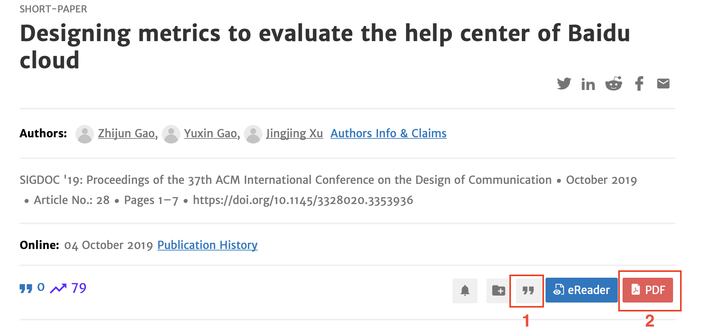
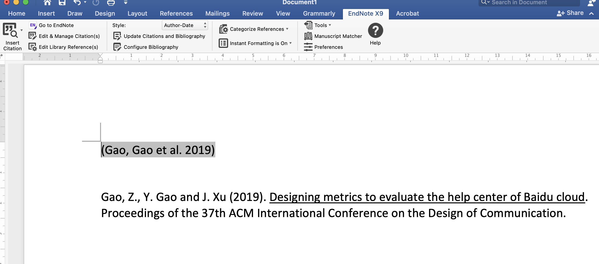

# EndNote 文档可用性测试小组作业

写在前面

技术文档是帮助用户用产品的，虽然目前用户使用文档学习软件产品的心智还没有形成，但是可用性测试这个方法是通用的。依据最小化文档设计的理论，新手不看说明，或者喜欢通过视频教程入门，这样的话在视频说明书录制后，依然需要对视频教程做可用性测试，确保最终的设计能满足设计目标，并在测试过程中发现文档问题，从而能及时改进设计。

## 作业要求
1. 小组作业，大家分工完成可用性测试的报告；
2. 下方为完成作业的建议，可以自由发挥。
3. 截止时间：
   - 软院：2021年12月21日 上午8点，课堂派提交
   - 外院：2021年12月23日 上午8点，课堂派提交

因为时间限制，建议大家既做被试，又作为可用性测试研究人员，建议的完成步骤如下：

## 自己作为被试

### 测试前的准备：

1. [通过北大正版软件共享平台](http://software.pku.edu.cn) ，下载EndNote 9，并完成激活；
2. 安装腾讯会议，并通过腾讯会议录制操作和被试表情；
3. 找到相对安静的地方，并熟悉一下 Think aloud方法

### 实验前的说明

1. 测试的是文档，而非同学的学习能力，大家的表现会用于改进文档；
2. 被试视频仅供课堂实验之用，不会外传；

### 开始实验

1. 启动腾讯会议，录制屏幕和人像，全程录制，完成任务时think aloud 直至完成全部任务；

2. 阅读 Help > Getting Started with Endnote 和 Help > Online User Guide 两个手册

3. 依次完成如下任务（做任务过程中可以随时参阅上方手册，但不可看其他材料）：

   **任务1**： 	下载文献 [Designing metrics to evaluate the help center of Baidu cloud](https://dl.acm.org/doi/10.1145/3328020.3353936) 的PDF，并通过 `”` (Export Citation) 功能导出EndNote的适用的文献数据(.enw)。

   

   

   

   

   

   **任务2**：  将任务1中下载的“文献引用”和 PDF 论文导入到 Endnote 的 Library中；

   **任务3**：  将文献引用插入到 Word 中。与下方效果一致即为成功：

   

   

## 作为可用性研究团队

1. 以小组成员或其他组的录屏作为研究样本（N>=5）；
2. 使用 Usability Datalogger，模拟可用性实验的实施过程，即：观察同学们的录屏，录入上方各被试在完成各任务时的：完成情况、完成时间、完成任务时所犯错误、完成任务的满意度（可使用SEQ量表）等
3. 形成 Endnote文档的可用性分值 （[SUM值](https://measuringu.com/sum-2/)），分析EndNote文档的可用性问题，并形成测试报告，以及你的改进建议。

### 作业工具包:

1.  [Usability Test Data Logger tool v5.1.1](https://www.userfocus.co.uk/resources/datalogger.html) 
2.  [Usability Test Plan Toolkit](https://www.userfocus.co.uk/articles/testplan.html)
3.  [UX Observation Coding](https://www.userfocus.co.uk/articles/datalogging.html) 
4.  [各种UX测试模板](https://www.usability.gov/how-to-and-tools/resources/templates.html)

