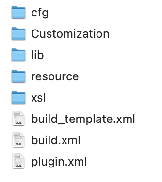
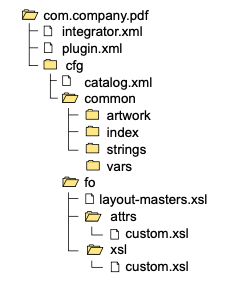

# DITA PDF 样式plugin制作

本文介绍开发`DITA-OT`样式plugin的方法。oXygen 发布内容的引擎，也是基于`DITA-OT`。本文以MacOS系统，并使用HomeBrew安装了DITA-OT为例来说明样式表的开发。其他系统或其他`dita-ot`的安装形式，插件开发大同小异，只是安装方式或调用方式有所不同。


## 前提条件

已经安装好 `dita-ot`	，如何安装`DITA-OT`，请参见[官方文档](https://www.dita-ot.org/dev/topics/installing-client.html)。


##  org.dita.pdf2插件 

### 找到插件所在位置

HomeBrew安装 `dita-ot`文件夹所在位置，一般在如下几个位置。

```
/usr/local/Cellar/
/usr/local/opt/
/usr/local/bin/
```

以笔者系统为例：

1. 在Finder->Go->Go to Folder，然后输入

  ```
  /usr/local/Cellar/
  ```

2. 在Cellar文件夹中按照下方路径，继续浏览

  ```
  /dita-ot/3.6.1/libexec/plugins/org.dita.pdf2
  ```


### 文件夹结构



| 项目          | 含义                                                         |
| ------------- | ------------------------------------------------------------ |
| cfg           | 存放样式的主要定义信息，其中还包括 `common` 和 `fo` 两个文件夹 |
| Customization | 存放用户自定义的样式信息                                     |
| lib           | 存放 Java 可执行程序 `fo.jar`                                |
| resource      |                                                              |
| xsl           | 存放 XSLT stylesheet                                         |


## 创建PDF plugin

1. 在plugins文件中，创建 `com.company.pdf`文件夹。

   > Java的命名传统，例如你的公司叫deepdok，可以用 com.deepdok.pdf来命名。还可以进一步增加说明，例如用户手册 (ug)的样式，可以写成。com.deepdok.pdf.ug

2. 模仿 `org.dita.pdf`的文件夹结构分别创建 `cfg` ,`fo`等文件夹和文件夹。

3. 在`cfg`文件夹中，新建catalog.xml，并在其中输入如下代码

   ```xml
   <?xml version="1.0" encoding="UTF-8"?>
   <catalog prefer="system" xmlns="urn:oasis:names:tc:entity:xmlns:xml:catalog">
     <uri name="cfg:fo/attrs/custom.xsl" uri="fo/attrs/custom.xsl"/>
     <uri name="cfg:fo/xsl/custom.xsl" uri="fo/xsl/custom.xsl"/>
   </catalog>
   ```

4. 在`fo/attrs`创建 custom.xsl文件，并输入如下内容

   ```
   <?xml version="1.0"?>
   <xsl:stylesheet xmlns:xsl="http://www.w3.org/1999/XSL/Transform"
       xmlns:fo="http://www.w3.org/1999/XSL/Format"
       version="2.0">
   </xsl:stylesheet>
   ```

5. 将 custom.xsl 复制到 fo/xsl中。虽然名字一样，但是用途不一样，以后通过 custom.xsl (attrs) 和 custom.xsl(xsl)来区分。

6. 在`com.company.pdf`中新建plugin.xml，并输入如下内容

   ```xml
   <?xml version='1.0' encoding='utf-8'?>
   <plugin id="com.company.pdf">
       <require plugin="org.dita.pdf2" />
       <feature extension="dita.conductor.transtype.check" value="custpdf" />
       <feature extension="dita.transtype.print" value="custpdf" />
       <feature extension="dita.conductor.target.relative" file="integrator.xml" />
   </plugin>
   ```

   > `dita.conductor.transtype.check`和`dita.transtype.print`的值为 `custpdf`，意思是使用 `custpdf`作为转换类型来调用。
   > 

7. 在`com.company.pdf`中新建integrator.xml，并输入如下内容

   ```xml
   <?xml version='1.0' encoding='utf-8'?>
   <project name="com.company.pdf">
       <target name="dita2custpdf.init">
           <property name="customization.dir" location="${dita.plugin.com.company.pdf.dir}/cfg"/>
           <property name="pdf2.i18n.skip" value="true"/>
       </target>
       <target name="dita2custpdf" depends="dita2custpdf.init, dita2pdf2"/>
   </project>
   ```

   > Project name 对应插件文件夹
   
8. 将 `org.dita.pdf2/cfg/fo`中的`layout-master.xsl` 复制一份到 `com.company.pdf/cfg/fo/`


最后的文件夹结构图




9. 注册插件，在plugins文件中，运行 `dita install`，即可注册。

## 参考教程

[DITA OT Creating a simple PDF plug-in](https://www.dita-ot.org/dev/topics/pdf-customization-example.html)

## 相关资源

- [PDF Plugin Generator](https://dita-generator.elovirta.com)
- [DITA OT CSS PDF](https://github.com/oxygenxml/dita-ot-css-pdf)
- [DITA-OT PDF Customization Plugin for oXygen User Manual](https://github.com/oxygenxml/com.oxygenxml.pdf2.ug)