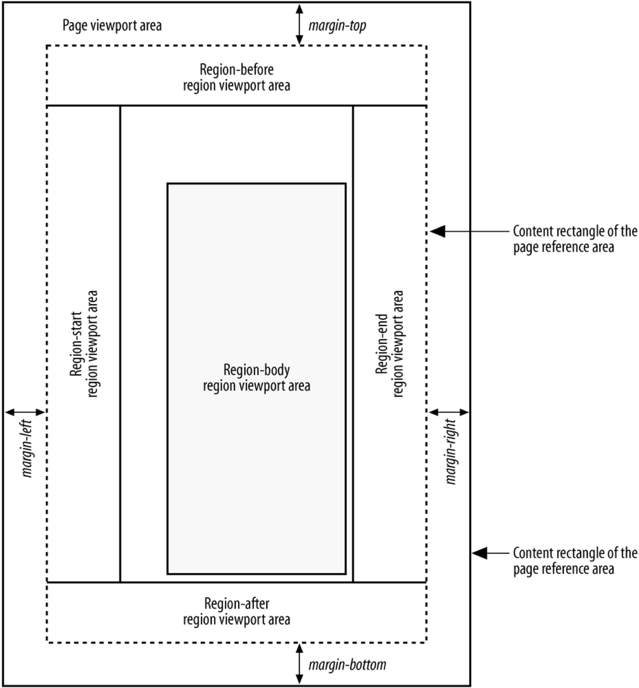
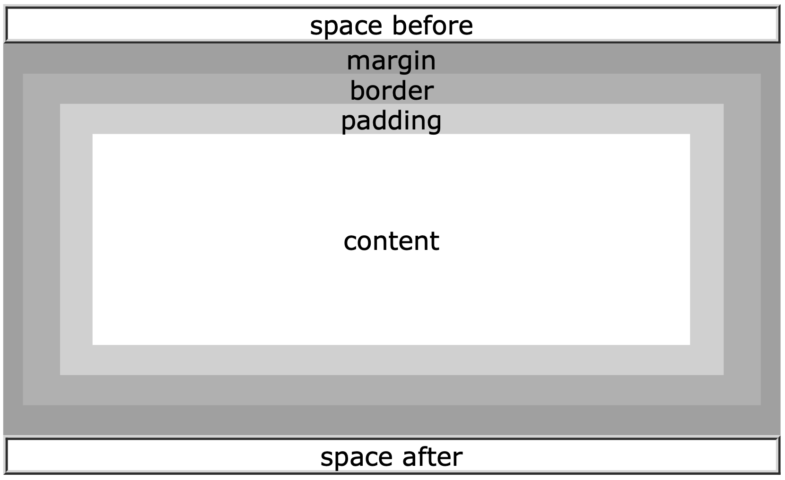

# XSL-FO 样式

## 什么是XSL-FO

XSL-FO  (Extensible Stylesheet Language Formating Object) 是定义XML数据输出格式的语言，以前是XSL的一部分。后来对W3C对XSL进行了拆分，于是有了如下的三个技术：

- XSLT，转换XML文件
- XSL 或 XSL-FO，格式化XML文件
- XPath，选择XML元素和属性


## 上手练习

之前我们练习了使用CSS输出XML的样式，现在我们来学习如何使用xsl-fo来定义XML的样式，并输出为PDF。


XML文件


```xml
<?xml version="1.0" encoding="utf-8"?>

<businesscard>
   
   <name>Zhijun Gao</name>
   <tel>010-11112222</tel>
   <phone>11122223333</phone>
   <email>gaozhijun@ss.pku.edu.cn</email>
   <profession>Researcher, Technical Communicator</profession>
   
</businesscard>
```


再解释各行语言之前，我们先开始上手写一些XSL-FO语句。

```xml
<?xml version="1.0" encoding="utf-8"?>
<xsl:stylesheet version="1.0"
    xmlns:xsl="http://www.w3.org/1999/XSL/Transform"
    xmlns:fo="http://www.w3.org/1999/XSL/Format">
    <xsl:output method="xml" indent="yes"/>
    <xsl:template match="/">
        <fo:root>
            <fo:layout-master-set>
                <fo:simple-page-master master-name="A4-portrait"
                    page-height="29.7cm" page-width="21.0cm" margin="2cm">
                    <fo:region-body   margin="3cm"/>
                    <fo:region-before extent="2cm"/>
                    <fo:region-after  extent="2cm"/>
                    <fo:region-start  extent="2cm"/>
                    <fo:region-end    extent="2cm"/>
                </fo:simple-page-master>
            </fo:layout-master-set>
            <fo:page-sequence master-reference="A4-portrait">
                
                
                <fo:flow flow-name="xsl-region-body">
                    <fo:block
                        border-width="1mm" 
                        font-size="20pt"
                        color="red"
                        font-family="Microsoft YaHei"
                        text-decoration="underline">
                        Brief Introduction
                    </fo:block>
                    
                    <fo:block>       
                        
                        <fo:external-graphic src="url('test.jpeg')"
                        content-height="5em" content-width="5em"/>
                    
                    </fo:block>
                    
                    <fo:block space-before="2mm"  font-family="Microsoft YaHei">
                        Name: <xsl:value-of select="businesscard/name"/>
                 
                    </fo:block>
                    <fo:block>
                        Phone: <xsl:value-of select="businesscard/phone"/>
                    </fo:block>
                    <fo:block>
                        tel: <xsl:value-of select="businesscard/tel"/>
                    </fo:block>
                    <fo:block>
                        email: <xsl:value-of select="businesscard/email"/>
                    </fo:block>
                    <fo:block>
                        profession: <xsl:value-of select="businesscard/profession"/>
                
                    </fo:block>
  
                </fo:flow>
                
            </fo:page-sequence>
        </fo:root>
    </xsl:template>
</xsl:stylesheet>
```


## XSL-FO语法说明
1. 声明自己是XML文件，确实xsl-fo本身也是xml格式。

    ```xml
    <?xml version="1.0" encoding="utf-8"?>
    ```

2. 对所有元素生效，XPath语句 "/"

    ```xml
     <xsl:template match="/">
    ```

3. 定义页面模板，可以是一页或多页

    ```xml
    <fo:layout-master-set>
      <!-- All page templates go here -->
    </fo:layout-master-set>


    ```
4. 定义单页模板，每个模板的名称必须唯一(`master-name`)，

    ```
    
    <fo:simple-page-master master-name="A4-portrait">
      <!-- One page template goes here -->
    </fo:simple-page-master>
    ```
    这里定义的就是竖版A4的样式。需要注意的是这里的A4只是一个名字，软件并不能通过A4这个名称就知道具体的定义，所以我们依然需要描述什么是竖版A4样式。A4纸的ISO 216的定义规格是29.7CM ×21.0CM，翻译为 xml 语句为： 

    ```xml
    page-height="29.7cm" page-width="21.0cm"
    ```


5. 定义各区块的属性。

    在解释具体属性之前，我们先看一下FO页面的区块布局。

    - 页面主体 `region-body`
    - 页眉`region-before`
    - 页脚`region-after`
    - 左侧边 `region-start`
    - 右侧边`region-end`

    
    
6. 定义fl ow和block

    页面和区域定义好之后，就需要定义Flow 和 Block的信息了。flow是由block组成的。

   在正文区定一个 flow，飞入到 “xsl-region-body"区域，这个任务翻译为xml语句，则为：

   ```
       <fo:flow flow-name="xsl-region-body">
         <fo:block>
           <!-- Output goes here -->
         </fo:block>
       </fo:flow>
   ```

   

7. 定义标题Block的属性。
      Flow中的每个内容都是一个block，都需要分别来定义。

    

    ```
    <fo:block
    border-width="1mm" 
    font-size="20pt"
    color="red"
    font-family="Microsoft YaHei"
    text-decoration="underline">
    Brief Introduction
    </fo:block>
      
    ```

8. 显示XML的值。

   例如名片的名字信息，我们定义了其block属性后，还需要将其xml中对应值读取过来，这里需要使用XPath预计。
  

    ~~~xml


      <xsl:value-of select="businesscard/name"/>


    ~~~


9. 使用FOP将XML输出为所需要的PDF。


## 参考资料

### xsl:fo 教程
- [XSL-FOT Tutorial by W3C School](https://w3schools.sinsixx.com/xslfo/default.asp.htm)
- [XSL Formatting Objects Tutorial](http://www.renderx.com/tutorial.html#Hello_World)

### xsl:fo 参考资料

- [XML Bible Chapter 16](http://www.ibiblio.org/xml/books/bible3/chapters/ch16.html)


### 发布引擎

- [Apache™ FOP](https://xmlgraphics.apache.org/fop/)
- [ANTENNA House](https://www.antennahouse.com/)


