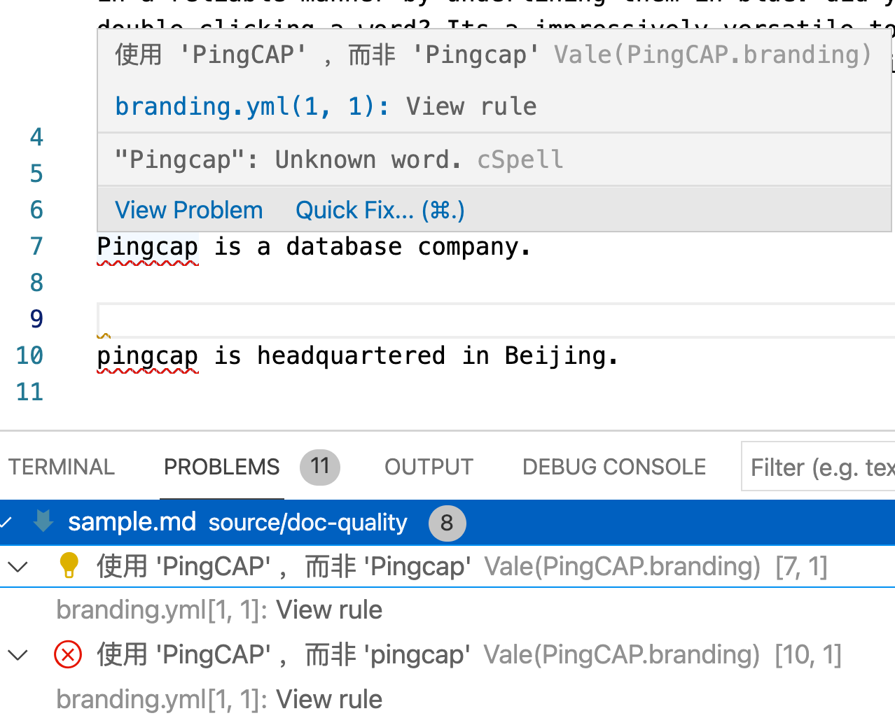

# Vale

Vale是一个功能非常强大的 Prose Linter，除了检查markdown之外，还可以检查DITA等标记文本。


## 如何使用

1. 安装 Vale `brew install vale`

2. 在需要检查的文件的根目录下创建 `.vale.ini`

3. 在  `.vale.ini` 中输入规则所在路径，以及需要启用的规则

   ```
   StylesPath = vale-styles/
   MinAlertLevel = error
   
   [*]
   BasedOnStyles = write-good
   vale.Editorializing = YES
   vale.Hedging = error
   ```

   

## 创建规则

### 规则解读

一般技术文档中，不推荐使用被动语态，如果希望linter检查此规则，则可以使用如下规则。

1. 识别出be动词
2. 识别be动词后所跟词汇(tokens)

一旦匹配，即会给用户提示错误，并告诉修改的方式。


```
extends: existence
message: "'%s' may be passive voice. Use active voice if you can."
ignorecase: true
level: warning
raw:
  - \b(am|are|were|being|is|been|was|be)\b\s*
tokens:
  - '[\w]+ed'
  - awoken
  - beat
  - become
  - been
  - begun
  - bent
  - beset
  - bet
  - bid
  - bidden
  - bitten
  - bled
  - blown
  - born
  - bought
  - bound
  - bred
  - broadcast
  - broken
  - brought
  - built
  - burnt
  - burst
  - cast
  - caught
  - chosen
  - clung
  - come
  - cost
  - crept
  - cut
  - dealt
  - dived
  - done
  - drawn
  - dreamt
  - driven
  - drunk
  - dug
  - eaten
  - fallen
  - fed
  - felt
  - fit
  - fled
  - flown
  - flung
  - forbidden
  - foregone
  - forgiven
  - forgotten
  - forsaken
  - fought
  - found
  - frozen
  - given
  - gone
  - gotten
  - ground
  - grown
  - heard
  - held
  - hidden
  - hit
  - hung
  - hurt
  - kept
  - knelt
  - knit
  - known
  - laid
  - lain
  - leapt
  - learnt
  - led
  - left
  - lent
  - let
  - lighted
  - lost
  - made
  - meant
  - met
  - misspelt
  - mistaken
  - mown
  - overcome
  - overdone
  - overtaken
  - overthrown
  - paid
  - pled
  - proven
  - put
(为节约空间，省去更多词表)
```


### 创建规则

#### Vale Studio

Vale 提供了一个可视化的规则编辑器 [Vale Studio](https://vale-studio.errata.ai/)。

#### 基本语法

```yaml
# All rules should define the following header keys:
#
# `extends` indicates the extension point being used (see below for information
# on the possible values).
extends: existence
# `message` is shown to the user when the rule is broken.
#
# Many extension points accept format specifiers (%s), which are replaced by
# extracted values. See the exention-specific sections below for more details.
message: "Consider removing '%s'"
# `level` assigns the rule's severity.
#
# The accepted values are suggestion, warning, and error.
level: warning
# `scope` specifies where this rule should apply -- e.g., headings, sentences, etc.
#
# See the Markup section for more information on scoping.
scope: heading
# `code` determines whether or not the content of code spans -- e.g., `foo` for
# Markdown -- is ignored.
code: false
# `link` gives the source for this rule.
link: 'https://errata.ai/'
# The number of times this rule should raise an alert.
#
# By default, there is no limit.
limit: 1
```


#### 规则示例

PingCAP公司是一个知名数据库公司，不少外部人士常常将公司名称写为pingcap或Pingcap等，需要一个规则文本进行检查，确保所有的文本或代码中，均使用了 PingCAP 的正确写法。

在 Styles 中新建PingCAP文件夹，并在其中新建 `branding.yml` 文件，并在其中输入下方规则


```yaml
---
extends: substitution
message: "使用 '%s' ，而非 '%s'"
level: error
ignorecase: false
# swap maps tokens in form of bad: good
swap:
  pingcap: PingCAP
  Pingcap: PingCAP
  PingCap: PingCAP

```


在VS Code中的检测效果




## 阅读材料

1. [Vale Style 教程](https://errata-ai.github.io/vale-server/docs/style)

2. 正则表达式教程 [Regular expression 101](https://regex101.com/r/NxwiwQ/1)

## 文件下载
1. <a href="sample.md" download>Sample.md 下载</a>