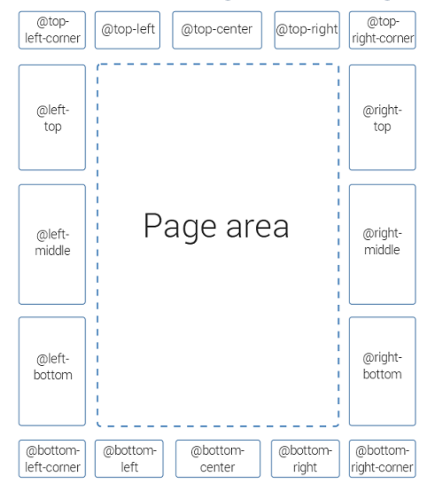

# 通过CSS定制PDF输出样式


## 排版基础


### 字体

当我们选择加粗的时候，实际上应用的是粗体的字集，所以一般都要提前准备好对应的字库。


本次练习，我们选择MI Sans 作为汉字字体，下载：[MI Sans](https://hyperos.mi.com/font/en/download/)


## 定制模板

1. 导出模板。


## PDF外观定制

### 导入字体

**`@font-face`** 是一个 CSS 规则，用于自定义字体，让开发者可以将特定的字体文件加载到PDF中，而不依赖用户系统中预装的字体。

这里我们引入MISans的不同字重(Weight)的字体，分别是：

- Normal
- Bold
- Thin

```css
@font-face {
	font-family: xiaomi-normal;
	src: url(resources/fonts/MiSans-Normal.ttf);
}

@font-face {
	font-family: xiaomi-bold;
	src: url(resources/fonts/MiSans-Bold.ttf);
}


@font-face {
	font-family: xiaomi-thin;
	src: url(resources/fonts/MiSans-Thin.ttf);
}
```


### 指定正文字体

正文字体决定了整个文档的观感，因为正文是全手册文字最多的。


```css
/* 用正常字体 */

body {
	font-size: 10pt;
	font-family: xiaomi-normal;
}

/* 用瘦体 */

body {
	font-size: 10pt;
	font-family: xiaomi-thin;
}
```

大家感觉一下，哪个更高级，是不是瘦的字体更显高级？

> S.H.E法则（纤细的，瘦弱的）


### 定制封面 

需要在封面添加下方三个要素：

1. 右上角的小米logo
2. 正下方添加出品机构  Xiaomi Group
3. 说明书标题调整（dita map的title）


Page Media各区域的划分如下：





#### 添加logo与出品机构

```css
/* 添加 logo */
/* 添加出品机构 */


@page front-page {
	@top-right-corner {
		content: url("resources/images/logo.png");
	}

	@bottom-center{
		content: "Xiaomi Group";
	}

}

  
```


#### 微调logo与出品机构

```css

@page front-page {
	@top-right-corner {
		content: url("resources/images/logo.png");
/* 往下调整一下logo的位置 */		
		margin-top: 30px;
	}

	@bottom-center{
		content: "Xiaomi Group \A 2024.11.11 ";
/* 微调字体 */
    white-space: pre;
		font-size: 10pt;
		color: gray;
		font-style: italic;
	}

}

  
```

### **`\A` 的作用**

- **`\A`** 是 CSS 的一种特殊字符表示法，用于在 `content` 属性中插入“换行符”。

- 它的效果需要结合 **`white-space: pre`** 或 **`white-space: pre-wrap`** 属性才能实现换行。

- 工作原理

  ：

  - 当 CSS 渲染内容时，`content: "Line 1\A Line 2";` 会在“Line 1”和“Line 2”之间插入一个换行符。
  - 如果没有启用 `white-space: pre` 或类似值，换行符会被忽略。


#### 微调封面标题

基本语法

**1. `*`（通配选择器）**

- **作用**：选择所有元素。
- **范围**：无论元素是 `div`、`p`、`h1`，只要它满足条件，都会应用此样式。

 **2. `[class ~= "front-page/front-page-title"]`**

- **属性选择器**：匹配带有 `class` 属性，且其值中包含 **以空格分隔的单词 `front-page/front-page-title`** 的元素。
- **条件**：`~=` 操作符要求 `class` 的值中存在一个单独的单词与 `front-page/front-page-title` 完全匹配。

可以找到 `projector.merged.html`，在html中查找各元素的属性。

```css
*[class ~= "front-page/front-page-title"] {
    font-family: xiaomi-bold;
	font-size: 26pt;

}
```

### 定制章节标题

将标题设置为小米黄`#FF6900`，同时调大字体。

```css
*[class ~= "topictitle1"] {
	font-family: xiaomi-normal;
	font-size: 16pt;
	color: #FF6900;

}

*[class ~= "topictitle2"] {
	font-family: xiaomi-normal;

	font-size: 14pt;
	color: #FF6900;

}
```


## 简化页眉页脚

只保留章节标题和页码。

**`counter(page)`**：

- 动态计数器，表示当前页面的页码。
- **`page` 是 CSS 内置计数器**，自动递增，无需显式定义。

```css
/*从全局变量 chaptertitle 中获取动态内容。*/


@page :left {
    @top-left {
        content: string(chaptertitle) " | " counter(page); 
    }
}

@page :right{
    @top-right {
        content: string(chaptertitle) " | " counter(page);
    }
}
```


## 傻瓜式定制模板

[Styles Basket](https://styles.oxygenxml.com/?_gl=1*1jy168z*_ga*MTI4NzYyMjkxOC4xNzI5NDE3MzI5*_ga_CKSFNYE9EY*MTczMzY3MDc1Ni4zMC4xLjE3MzM2NzEwNzguNTkuMC4w*_ga_HEWSDXWJSN*MTczMzY3MDc1Ni4yOC4xLjE3MzM2NzEwNzguMC4wLjA.) 可以让用户通过图形界面简单操作即可生成基础模板，并可使用css进一步定制。


## 参考

1. [Customizing PDF Output Using CSS](https://www.oxygenxml.com/doc/versions/23.0/ug-ope/topics/dcpp_the_customization_css.html)
1. [MI Sans](https://hyperos.mi.com/font/en/download/)
1. [Oxygen Styles Basket](https://styles.oxygenxml.com/?_gl=1*1mtx7jj*_ga*MTI4NzYyMjkxOC4xNzI5NDE3MzI5*_ga_CKSFNYE9EY*MTczMzY3MDc1Ni4zMC4xLjE3MzM2NzEwNzguNTkuMC4w*_ga_HEWSDXWJSN*MTczMzY3MDc1Ni4yOC4xLjE3MzM2NzEwNzguMC4wLjA.)
2. [CSS Customization Webinar](https://www.oxygenxml.com/doc/versions/27.0/ug-editor/topics/dcpp_overview.html)
