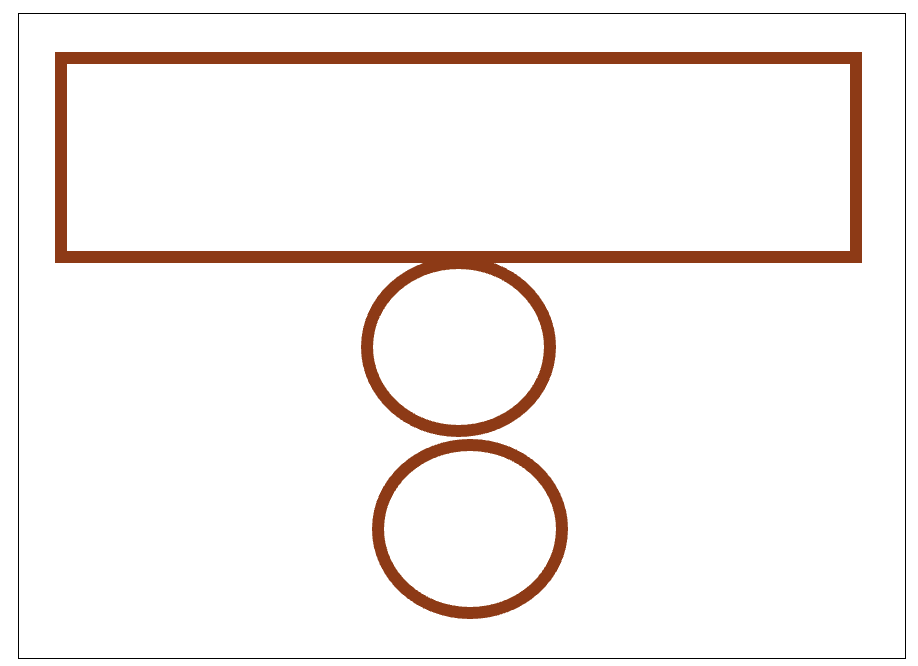
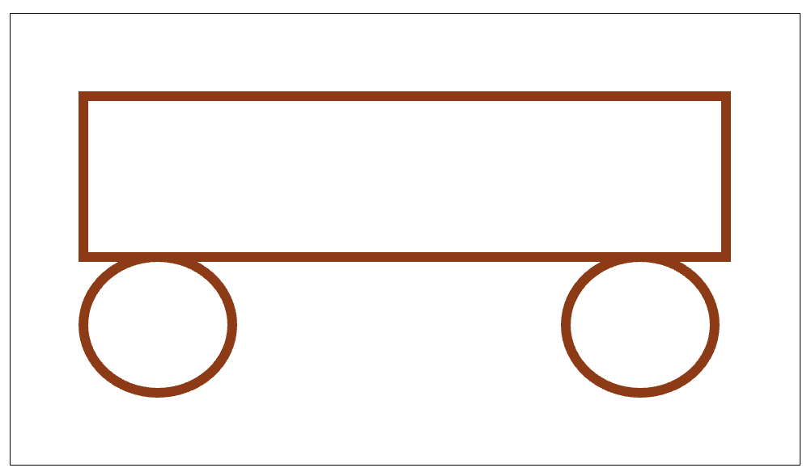
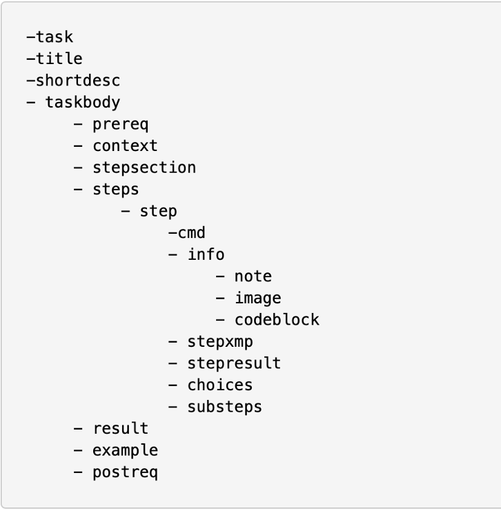

# 写步骤

在技术写作中，清晰且准确地撰写操作步骤是一项至关重要的技能。步骤的描述直接影响用户能否顺利完成预期任务，因此文档工程师必须深入理解步骤写作的核心要素和技巧。

## 理解目标的重要性

目标是用户希望实现并着手完成的有意义任务，它清晰地描述了用户通过执行步骤后所期望达到的状态。明确的目标能够帮助用户更好地理解任务的意图，从而有效地填补用户理解中的空白。

技术写作中的目标应具体且明确，避免模棱两可，以免用户产生误解或困惑。

### 如何清晰地描述目标

- 当一个任务需要用户执行许多具体操作时，文档工程师应将整体目标细分为两个或多个易于实现和理解的子目标或中间状态。
- 明确展示任务的前后状态，帮助用户直观地理解每一步操作的意义。
- 在设定目标时，应避免在标题中使用过于专业或生僻的术语，而应使用用户易于理解的日常语言。
- 在目标标题下，建议用1-2句话简明扼要地解释和概述任务目标，增强用户理解的清晰性。

## 写步骤的关键要素

为了有效地撰写步骤，文档工程师需要清楚以下关键信息：

1. 用户的起始状态（当前状态）。
2. 用户期望达成的结束状态（目标状态）。
3. 为达到目标而必须执行的一系列具体、明确的操作。
4. 每个操作执行后的预期结果或反馈。

步骤的描述需要有逻辑顺序，确保用户能够逐步理解并顺利执行。

## 小实验：展示目标与步骤描述的关系

以下实验将帮助我们直观理解明确目标的重要性。

### 实验步骤

请大家按照以下指令进行绘画：

- 首先，画一个矩形。
- 然后，在这个矩形下方画一个圆。
- 接着，再在下方画另一个圆。

一小部分参与者可能画出以下结果：

然而，我实际期望的是这样的图案：

### 实验分析与结论

为什么会出现这种差异呢？主要原因在于我最初的指令缺乏明确的整体目标描述，导致不同人根据自身理解产生不同的结果。

如果我一开始明确地告诉大家整体目标，例如“给大家看下我所期望大家画的图”，然后再给出具体的操作步骤，相信所有人都会画出我期望的图案。

这个实验清楚地展示了在撰写步骤时，首先明确目标对避免误解和提高用户准确执行的重要性。因此，文档工程师在撰写步骤时，应始终优先清晰地描述整体任务目标。

### 动手尝试

请大家阅读下方步骤，并尝试修改下方步骤：

如何使用门禁系统远程开门：
1. 拿起听筒  
2. 等待提示音  
3. 输入：#87*  
4. 输入您的识别码  
5. 输入：#  
6. 等待提示音  
7. 输入：*81*  
8. 输入相应的房间号  
9. 输入：#  
10. 等待提示音  
11. 如果您想开启更多的房门：重复步骤8、9、10  
12. 输入：#  
13. 放下听筒

### 如何描述目标

在撰写目标描述时，应注意以下要点：

- 避免在目标描述中使用专业术语或特定菜单名称。
  - 示例：
    - 原文：使用“格式”菜单
    - 修订版：更改演示文稿的外观
- 帮助读者建立完成任务过程的清晰“规划”，明确解释用户执行任务的理由。
  - 示例：保存文件 
    -  😂 本部分描述了如何保存文件。
    - 😊 避免丢失数据，定期保存文件副本。

通过明确且易懂的目标描述，有效指导用户顺利完成任务。

 

### 前提条件（Prerequisites）

在开始执行步骤之前，必须确保满足一定的先决条件，才能保证用户顺利且正确地完成目标。前提条件能让用户在进入操作流程前，就做好必要的准备，避免中途因缺少资源或技能而产生阻碍。

#### 关键考虑因素

1. **外部条件**
   - **系统状态**
     - 操作系统版本（如 Windows 10、macOS Monterey 12.0 及以上）
     - 已启动或登录所需的服务／应用（如已登录企业 VPN、数据库服务在线）
   - **所需材料与工具**
     - 硬件设备（如打印机、扫描仪、USB 设备）
     - 软件安装包或依赖库（如已下载并放置在指定目录的安装程序）
     - 网络连接（如稳定的宽带或内网环境）
2. **受众特征**
   - **先前知识**
     - 用户是否具备基础概念（如了解文件系统的基本结构、懂得常见命令行操作）
     - 是否已阅读过相关教程或文档（如入门指南、快速上手手册）
   - **技能水平**
     - 操作熟练度（如熟悉点击、拖拽、命令行输入等基本交互方式）
     - 问题排查能力（如能够根据提示信息自行判断并解决简单错误）
   - **动机与目标**
     - 完成任务的业务需求或学习目的（如为了提交报告、演示演讲）
     - 可投入的时间与精力（如预计本次操作需时 10 分钟以内）

#### 示例

**任务**：在本地环境中启动数据库并导入测试数据

- **外部条件**：
  - 已安装 Docker（版本 ≥ 20.10）
  - 本地端口 5432 未被占用
- **受众特征**：
  - 了解基本的 Docker 命令（如 `docker run`、`docker ps`）
  - 熟悉关系型数据库概念，知道如何使用 psql 或 pgAdmin 连接数据库

通过在文档开头清晰列出上述前提条件，用户可在动手操作前完成环境搭建并自我评估技能匹配度，从而大幅降低使用过程中的失败率与挫败感。

## 步骤编写的高效策略

在撰写操作步骤时，不仅要保证准确无误，还要考虑用户的认知负荷和学习效率。下面几条策略可以帮助你提高步骤的可读性与可执行性。

1. **保持步骤数量在“神奇数字 7”以内**
    根据认知心理学研究，人类短期记忆容量大约为 5–9 条信息（神奇数字 7）。当步骤过多时，用户容易遗忘前面内容或中途放弃。

   - **最佳实践**：将一个复杂的流程拆解成若干小节，每节控制在 5–7 步之内；如果流程较长，则为每个子目标分别编写短小的步骤列表。

2. **若需快速掌握，将关键步骤限制为 3 条**
    对于初学者或在“快速上手”场景中，仅呈现最核心的 3 条操作，可显著提升学习速度和完成率。

   - **示例**：在“安装并启动软件”的快速指南中，只列出“下载–安装–运行”三步，然后在后续章节再详细展开其他可选配置。

3. **遵循使用顺序原则**
    步骤应严格按照实际操作流程排列，从最先发生的动作到最后完成的状态，避免让用户“跳跃”执行。

   >原来：点击**保存**按钮，该按钮在**文件**菜单中；
    >
    >修改：找到**文件**菜单，点击**保存**按钮。
    >
    >
   
4. **插入反思性间隔**
    在每隔 2–3 步后，添加一个简短的“检查点”或“思考问题”，让用户回顾已完成的操作，并预估下一步的效果。

   - **示例**：

     > **检查点**：确保已成功连接到数据库，再继续下一步导入数据。

5. **展示完整而非部分截图**
    部分截图会让用户迷失在界面细节中。提供完整界面截图，并在截图上高亮或框选重点区域，帮助用户建立整体感。

   - **技巧**：使用标注箭头或半透明遮罩突出关键控件，同时保留背景界面以便用户对照。

6. **将相关内容一起呈现**
    将相互依赖或同一功能模块下的所有操作步骤集中在一处，避免用户在文档中来回跳转。

   - **做法**：对于“配置环境变量”这类操作，先集中展示所有环境变量的添加、修改、验证步骤，再统一进行示例说明。

DITA的提供了一个非常好的步骤的结构，这类写给大家参考，后面我们会进一步解释。

